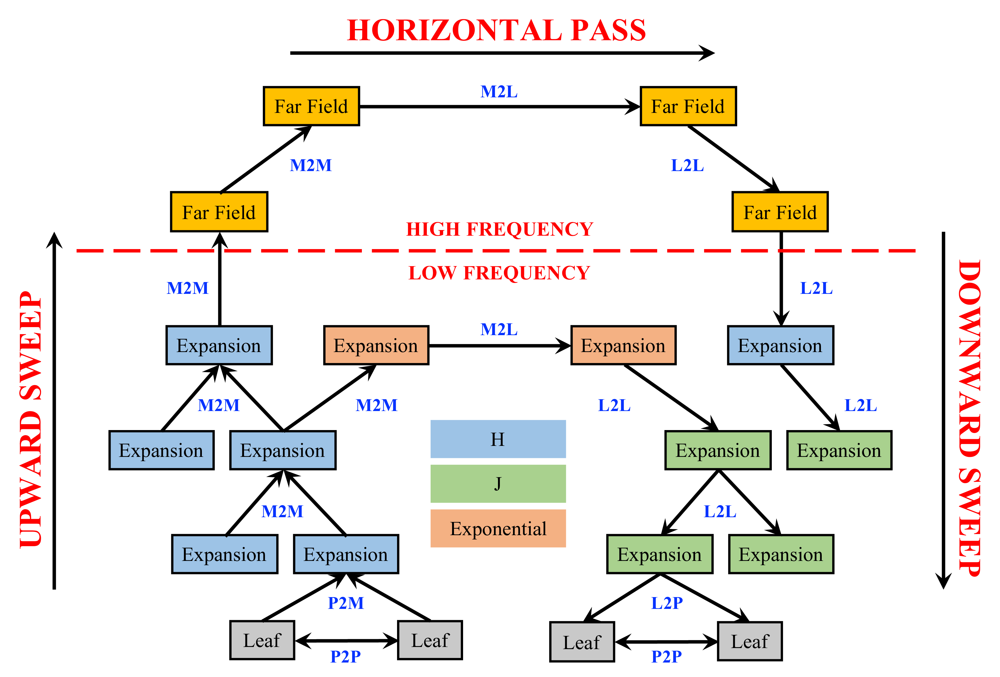
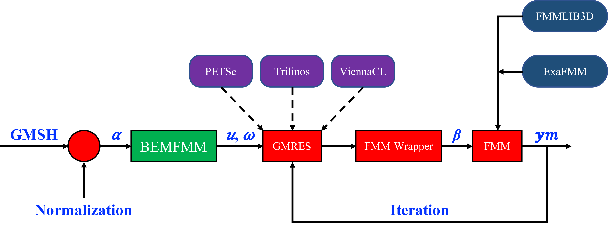
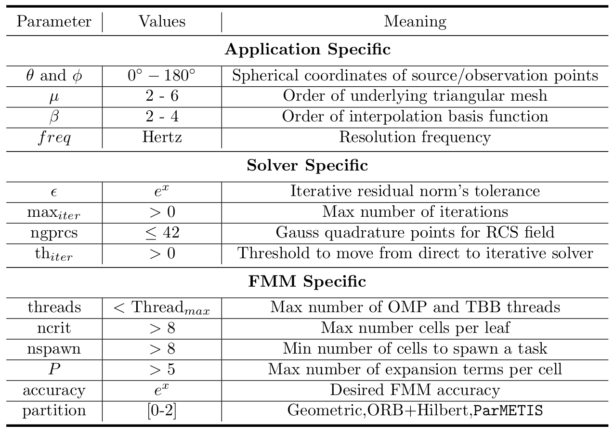

# BEMFMM # [](https://badge.fury.io/gh/ecrc%2FBEMFMM) [](https://opensource.org/licenses/MIT)

**BEMFMM** is an extreme-scale Fast Multipole Method (FMM)-accelerated Boundary Element Method (BEM) solver for wave scattering. It calculates the scattered field due to an excitation source at a specific point in space or infinity. The Krylov subspace liner solver is featured by GMRES iterative method, inside which FMM accelerates the Matrix-Vector multiplication. The solver is highly optimized for both shared- and distributed-memory architectures. It features optimal architecture-specific and algorithm-aware partitioning, load balancing, and communication reducing mechanisms. The solver code utilizes two state-of-the-art FMM implementation for oscillatory kernels, namely *ExaFMM* and *FMMLIB3D*.

## The Underlying FMM Implementation ##



## System Workflow ##



## Requirements ##

* C/C++ Compiler (e.g., **GNU Compiler** -- https://www.gnu.org/software/gcc/)
* MPI  (e.g., **MPICH** -- http://www.mpich.org/)
* LAPACK (e.g., **NETLIB LAPACK** -- http://www.netlib.org/lapack/)
* Intel TBB (https://www.threadingbuildingblocks.org/)
* ParMETIS (http://glaros.dtc.umn.edu/gkhome/metis/parmetis/overview)

The repository includes **LAPACK**, **TBB**, and **ParMETIS**. Therefore, you may not need to install yours, you can just use the ones that are included herein. However, if you have a better implementation that you wish to link to, you can just install it on your software environment, and directly link to your existing implementation. Hence, the minimum requirements to run BEMFMM are:

* C/C++ Compiler (e.g., **GNU Compiler** -- https://www.gnu.org/software/gcc/)
* MPI  (e.g., **MPICH** -- http://www.mpich.org/)

Please have these two dependencies configured and installed on your system before running the solver code.

## Compiling and Linking ##

Edit make.inc file to include all of your installed dependencies. The default ones are set to GNU GCC compiler with MPICH. If you have these two configured and installed on your system, then you may not need to edit the make.inc file. Anything that you do not want to include in the make, just comment it out in the make.inc. The Makefile, on the other hand, is dynamic, therefore, you do not need to change it. All of your changes must be directed to the make.inc file only. Even if you want to add additional compiler's flags, use **USERCXXFLAGS**, **USERLIBS**, **USERINCS** variables in the make.inc to include all of your flags. Once you edit the make.inc file, you can just do:

```bash
make clean
make all
```

`make` should generate an executable binary file called: **bemfmm_test_mpi**. You can run it directly with `mpirun` executable command. Please provide your command-line arguments. To learn about all of the available command-line arguments supplemented in our solver code, use `-h` or `--help`, which lists all of the available command-line arguments.

### Running Test Cases ###

To give you a flavor of the excepted outputs, you can use: `make test_serial`, for serial execution, or `make test_parallel`, for parallel execution. Note: You may need to add TBB library path to your **LD_LIBRARY_PATH**, before you run the executable. To do so, run the following bash command:

```bash
export LD_LIBRARY_PATH="TBB/lib:$LD_LIBRARY_PATH"
```

The example herein assumes that you are using the TBB implementation provided with BEMFMM. Hence, you may want to replace `TBB/lib` with your TBB libray path.

## Tested Architectures ##

* Shaheen Supercomputer at KAUST -- Cray XC40
  * GNU Programming Environment -- GCC version 7.2.0
  * Cray MPICH version 7.7.0
  * Used the repository provided library for TBB, ParMETIS, and LINPACK
* Intel Skylake Scalable Processor Server [56 Cores (dual-socket)]
  * Intel Parallel Studio 2018 Update 3
  * Intel ICPC
  * Intel MPI
  * Intel MKL
  * Intel TBB
  * Used the repository provided library for ParMETIS
* Intel Knights Landing Server [72 Cores and 64 Cores]
  * Intel Parallel Studio 2018 Update 1
  * Intel ICPC
  * Intel MPI
  * Intel MKL
  * Intel TBB
  * Used the repository provided library for ParMETIS
* Intel Haswell Server [36 Cores (dual-socket)]
  * Intel Parallel Studio 2018 Update 3
  * Intel ICPC
  * Intel MPI
  * Intel MKL
  * Intel TBB
  * Used the repository provided library for ParMETIS
* Intel IvyBridge Server [20 Cores (dual-socket)]
  * GNU GCC version 7.3.0
  * MPICH version 3.2
  * Used the repository provided library for TBB, ParMETIS, and LINPACK

## Control Parameters ##



## Contact ##

* mustafa.abduljabbar@kaust.edu.sa
* mohammed.farhan@kaust.edu.sa

## Website ##

https://ecrc.github.io/BEMFMM/

## License ###

MIT License
